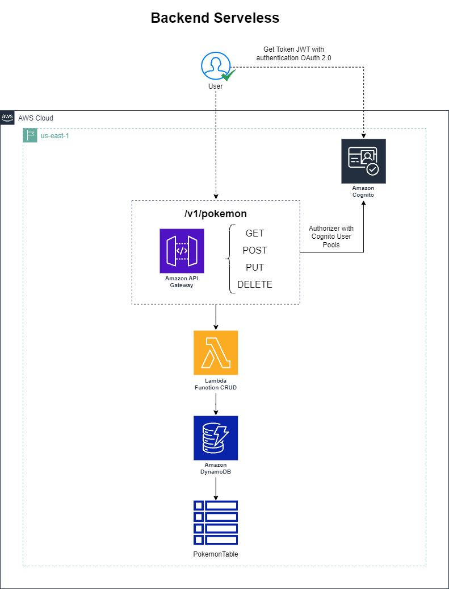

# Terraform - AWS Backend Serveless - CRUD

## ✏️ Architecture

<div align="center">
</div>

------

## ✅ Requirements

- [terraform] - v 1.6.6
- [hashicorp/aws] v 5.31.0

## 📑 Project Structure Terraform

```
  |-- apigateway-crud.tf
  |-- authorizer.tf
  |-- cognito.tf
  |-- dynamodb.tf
  |-- iam_lambda.tf
  |-- lambda_crud.tf
```

## 🔮 Support this project  

If you want to support this project, leave a ⭐.  

---  

Made with 💙 &nbsp;by Marco Antonio 👋 &nbsp; [Meu LinkedIn](https://www.linkedin.com/in/mrk-silva/)  